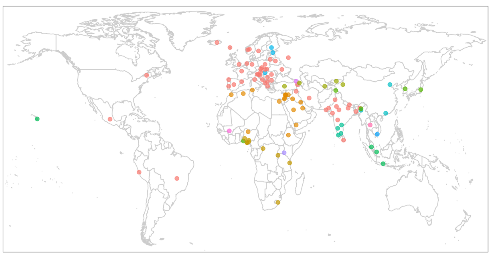

# Global PIQA v0.1

<b>Global PIQA</b> is a participatory commonsense reasoning benchmark for over 100 languages, constructed by hand by 335 researchers from 65 countries around the world.
The 116 language varieties in Global PIQA cover five continents, 14 language families, and 23 writing systems.
In the non-parallel split of Global PIQA, over 50% of examples reference local foods, customs, traditions, or other culturally-specific elements.
Details are in our preprint: [Global PIQA: Evaluating Physical Commonsense Reasoning Across 100+ Languages and Cultures (2025)](https://arxiv.org/abs/2510.24081).

<picture>

</picture>

Following the English PIQA dataset ([Bisk et al., 2020](https://arxiv.org/abs/1911.11641)), each example consists of a prompt and two candidate solutions, one correct and one incorrect.
Determining the correct solution is designed to require physical commonsense reasoning, although we allow for fairly flexible definitions of physical commonsense (e.g. knowledge of physical properties of objects, affordances, physical and temporal relations, and everyday activities).
Beyond its uses for LLM evaluation, we hope that Global PIQA provides a glimpse into the wide diversity of cultures in which human language is embedded.

<b>Get involved!</b> For Global PIQA v1, we plan to expand the language coverage of Global PIQA and add a parallel split of the dataset. If you speak a language currently not represented in Global PIQA, please fill out the interest form [here](https://docs.google.com/forms/d/e/1FAIpQLSc73SSB2Med_SEpsSvOEcw50g3Y1kkK6od8ZfRlL0162vi3lw/viewform?usp=header)!

Dataset on Hugging Face: https://huggingface.co/datasets/mrlbenchmarks/global-piqa-nonparallel

Preprint: https://arxiv.org/abs/2510.24081

## License

Global PIQA is released under a [CC BY-SA 4.0](https://creativecommons.org/licenses/by-sa/4.0/deed.en) license. However, we do <b>not</b> allow training of AI systems on Global PIQA, or on synthetic data that uses Global PIQA as a seed.
Global PIQA is intended for LLM evaluation only.

## This repository

This repository contains supplementary files for the Global PIQA dataset, including the original instructions for authors, dataset descriptions from individual groups, and eval results on existing language models.

## Citation
```
@article{mrl-workshop-2025-global-piqa,
  title={Global {PIQA}: Evaluating Physical Commonsense Reasoning Across 100+ Languages and Cultures},
  author={Tyler A. Chang and Catherine Arnett and Abdelrahman Eldesokey and Abdelrahman Sadallah and Abeer Kashar and Abolade Daud and Abosede Grace Olanihun and Adamu Labaran Mohammed and Adeyemi Praise and Adhikarinayum Meerajita Sharma and Aditi Gupta and Afitab Iyigun and Afonso Simplício and Ahmed Essouaied and Aicha Chorana and Akhil Eppa and Akintunde Oladipo and Akshay Ramesh and Aleksei Dorkin and Alfred Malengo Kondoro and Alham Fikri Aji and Ali Eren Çetintaş and Allan Hanbury and Alou Dembele and Alp Niksarli and Álvaro Arroyo and Amin Bajand and Amol Khanna and Ana Chkhaidze and Ana Condez and Andiswa Mkhonto and Andrew Hoblitzell and Andrew Tran and Angelos Poulis and Anirban Majumder and Anna Vacalopoulou and Annette Kuuipolani Kanahele Wong and Annika Simonsen and Anton Kovalev and Ashvanth.S and Ayodeji Joseph Lana and Barkin Kinay and Bashar Alhafni and Benedict Cibalinda Busole and Bernard Ghanem and Bharti Nathani and Biljana Stojanovska Đurić and Bola Agbonile and Bragi Bergsson and Bruce Torres Fischer and Burak Tutar and Burcu Alakuş Çınar and Cade J. Kanoniakapueo Kane and Can Udomcharoenchaikit and Catherine Arnett and Chadi Helwe and Chaithra Reddy Nerella and Chen Cecilia Liu and Chiamaka Glory Nwokolo and Cristina España-Bonet and Cynthia Amol and DaeYeop Lee and Dana Arad and Daniil Dzenhaliou and Daria Pugacheva and Dasol Choi and Daud Abolade and David Liu and David Semedo and Deborah Popoola and Deividas Mataciunas and Delphine Nyaboke and Dhyuthy Krishna Kumar and Diogo Glória-Silva and Diogo Tavares and Divyanshu Goyal and DongGeon Lee and Ebele Nwamaka Anajemba and Egonu Ngozi Grace and Elena Mickel and Elena Tutubalina and Elias Herranen and Emile Anand and Emmanuel Habumuremyi and Emuobonuvie Maria Ajiboye and Eryawan Presma Yulianrifat and Esther Adenuga and Ewa Rudnicka and Faith Olabisi Itiola and Faran Taimoor Butt and Fathima Thekkekara and Fatima Haouari and Filbert Aurelian Tjiaranata and Firas Laakom and Francesca Grasso and Francesco Orabona and Francesco Periti and Gbenga Kayode Solomon and Gia Nghia Ngo and Gloria Udhehdhe-oze and Gonçalo Martins and Gopi Naga Sai Ram Challagolla and Guijin Son and Gulnaz Abdykadyrova and Hafsteinn Einarsson and Hai Hu and Hamidreza Saffari and Hamza Zaidi and Haopeng Zhang and Harethah Abu Shairah and Harry Vuong and Hele-Andra Kuulmets and Houda Bouamor and Hwanjo Yu and Iben Nyholm Debess and İbrahim Ethem Deveci and Ikhlasul Akmal Hanif and Ikhyun Cho and Inês Calvo and Inês Vieira and Isaac Manzi and Ismail Daud and Itay Itzhak and Iuliia (Julia) Alekseenko and Ivan Belashkin and Ivan Spada and Ivan Zhelyazkov and Jacob Brinton and Jafar Isbarov and Jaka Čibej and Jan Čuhel and Jan Kocoń and Jauza Akbar Krito and Jebish Purbey and Jennifer Mickel and Jennifer Za and Jenny Kunz and Jihae Jeong and Jimena Tena Dávalos and Jinu Lee and João Magalhães and John Yi and Jongin Kim and Joseph Chataignon and Joseph Marvin Imperial and Jubeerathan Thevakumar and Judith Land and Junchen Jiang and Jungwhan Kim and Kairit Sirts and Kamesh R and Kamesh V and Kanda Patrick Tshinu and Kätriin Kukk and Kaustubh Ponkshe and Kavsar Huseynova and Ke He and Kelly Buchanan and Kengatharaiyer Sarveswaran and Kerem Zaman and Khalil Mrini and Kian Kyars and Krister Kruusmaa and Kusum Chouhan and Lainitha Krishnakumar and Laura Castro Sánchez and Laura Porrino Moscoso and Leshem Choshen and Levent Sencan and Lilja Øvrelid and Lisa Alazraki and Lovina Ehimen-Ugbede and Luheerathan Thevakumar and Luxshan Thavarasa and Mahnoor Malik and Mamadou K. Keita and Mansi Jangid and Marco De Santis and Marcos García and Marek Suppa and Mariam D'Ciofalo and Marii Ojastu and Maryam Sikander and Mausami Narayan and Maximos Skandalis and Mehak Mehak and Mehmet İlteriş Bozkurt and Melaku Bayu Workie and Menan Velayuthan and Michael Leventhal and Michał Marcińczuk and Mirna Potočnjak and Mohammadamin Shafiei and Mridul Sharma and Mrityunjaya Indoria and Muhammad Ravi Shulthan Habibi and Murat Kolić and Nada Galant and Naphat Permpredanun and Narada Maugin and Nicholas Kluge Corrêa and Nikola Ljubešić and Nirmal Thomas and Nisansa de Silva and Nisheeth Joshi and Nitish Ponkshe and Nizar Habash and Nneoma C. Udeze and Noel Thomas and Noémi Ligeti-Nagy and Nouhoum Coulibaly and Nsengiyumva Faustin and Odunayo Kareemat Buliaminu and Odunayo Ogundepo and Oghojafor Godswill Fejiro and Ogundipe Blessing Funmilola and Okechukwu God'spraise and Olanrewaju Samuel and Olaoye Deborah Oluwaseun and Olasoji Akindejoye and Olga Popova and Olga Snissarenko and Onyinye Anulika Chiemezie and Orkun Kinay and Osman Tursun and Owoeye Tobiloba Moses and Oyelade Oluwafemi Joshua and Oyesanmi Fiyinfoluwa and Pablo Gamallo and Pablo Rodríguez Fernández and Palak Arora and Pedro Valente and Peter Rupnik and Philip Oghenesuowho Ekiugbo and Pramit Sahoo and Prokopis Prokopidis and Pua Niau-Puhipau and Quadri Yahya and Rachele Mignone and Raghav Singhal and Ram Mohan Rao Kadiyala and Raphael Merx and Rapheal Afolayan and Ratnavel Rajalakshmi and Rishav Ghosh and Romina Oji and Ron Kekeha Solis and Rui Guerra and Rushikesh Zawar and Sa'ad Nasir Bashir and Saeed Alzaabi and Sahil Sandeep and Sai Pavan Batchu and SaiSandeep Kantareddy and Salsabila Zahirah Pranida and Sam Buchanan and Samuel Rutunda and Sander Land and Sarah Sulollari and Sardar Ali and Saroj Sapkota and Saulius Tautvaisas and Sayambhu Sen and Sayantani Banerjee and Sebastien Diarra and SenthilNathan.M and Sewoong Lee and Shaan Shah and Shankar Venkitachalam and Sharifa Djurabaeva and Sharon Ibejih and Shivanya Shomir Dutta and Siddhant Gupta and Silvia Paniagua Suárez and Sina Ahmadi and Sivasuthan Sukumar and Siyuan Song and Snegha A. and Sokratis Sofianopoulos and Sona Elza Simon and Sonja Benčina and Sophie Gvasalia and Sphurti Kirit More and Spyros Dragazis and Stephan P. Kaufhold and Suba.S and Sultan AlRashed and Surangika Ranathunga and Taiga Someya and Taja Kuzman Pungeršek and Tal Haklay and Tasi'u Jibril and Tatsuya Aoyama and Tea Abashidze and Terenz Jomar Dela Cruz and Terra Blevins and Themistoklis Nikas and Theresa Dora Idoko and Thu Mai Do and Tilek Chubakov and Tommaso Gargiani and Uma Rathore and Uni Johannesen and Uwuma Doris Ugwu and Vallerie Alexandra Putra and Vanya Bannihatti Kumar and Varsha Jeyarajalingam and Varvara Arzt and Vasudevan Nedumpozhimana and Viktoria Ondrejova and Viktoryia Horbik and Vishnu Vardhan Reddy Kummitha and Vuk Dinić and Walelign Tewabe Sewunetie and Winston Wu and Xiaojing Zhao and Yacouba Diarra and Yaniv Nikankin and Yash Mathur and Yixi Chen and Yiyuan Li and Yolanda Xavier and Yonatan Belinkov and Yusuf Ismail Abayomi and Zaid Alyafeai and Zhengyang Shan and Zhi Rui Tam and Zilu Tang and Zuzana Nadova and Baber Abbasi and Stella Biderman and David Stap and Duygu Ataman and Fabian Schmidt and Hila Gonen and Jiayi Wang and David Ifeoluwa Adelani},  
  journal={Preprint},
  year={2025},
  url={https://arxiv.org/abs/2510.24081},
}
```
